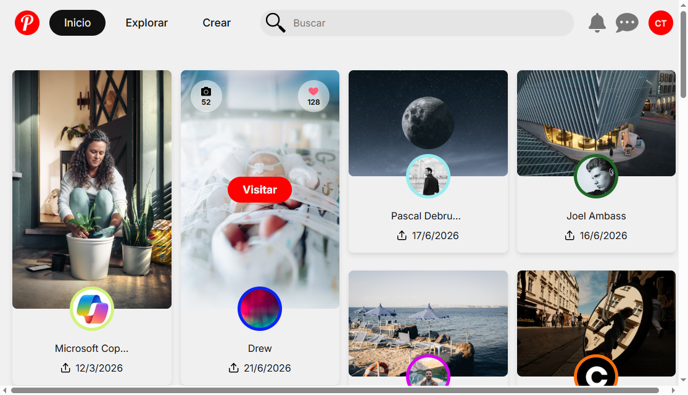
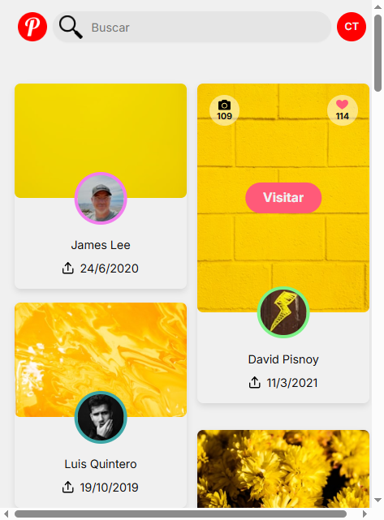

# RTC Proyecto: Pinterest Async

Segundo proyecto del **Máster Desarrollador Full Stack (2025-2026)**.

Réplica de una galería tipo Pinterest desarrollada con JavaScript y Vite. La aplicación consulta la API de Unsplash para mostrar fotografías recientes, permite buscar por texto y añade nuevas páginas mediante scroll infinito. El diseño es responsive y las tarjetas conservan las proporciones variables de las imágenes.

## Documentación

- [Justificación de los requisitos](./docs/dev-notes/justificacion-requisitos.md): guía rápida para comprobar cómo se cumple cada criterio de evaluación.
- [Notas de desarrollo](./docs/dev-notes/notas-desarrollo.md): arquitectura, flujo de datos y decisiones técnicas del proyecto.

## Capturas

| Escritorio | Móvil |
| --- | --- |
|  |  |

## Instalación y ejecución

### Requisitos previos

- Node.js y npm.
- Una cuenta de desarrollador de Unsplash y una Access Key.

### Pasos

1. Clonar el repositorio y entrar en la carpeta:

   ```bash
   git clone <URL-del-repositorio>
   cd pinterest-clone
   ```

2. Instalar las dependencias:

   ```bash
   npm install
   ```

3. Copiar `.env.example` como `.env` y añadir la clave de Unsplash:

   ```env
   VITE_UNSPLASH_ACCESS_KEY=TU_ACCESS_KEY
   ```

4. Iniciar el servidor de desarrollo:

   ```bash
   npm run dev
   ```

5. Abrir en el navegador la dirección que muestre Vite, normalmente `http://localhost:5173`.

La clave debe empezar por `VITE_` para que Vite pueda exponerla a la aplicación. El archivo `.env` no debe subirse al repositorio.

### Versión de producción

```bash
npm run build
npm run preview
```

`build` genera la aplicación en `dist/` y `preview` permite revisar esa versión localmente.

## Funcionalidades principales

- Carga inicial de fotografías recientes.
- Búsqueda de imágenes por texto.
- Scroll infinito con paginación.
- Reinicio del contenido al pulsar el logo.
- Limpieza automática del buscador después de cada búsqueda.
- Tarjetas responsive con fotografía, autor, avatar, fecha, enlaces y datos de Unsplash.
- Skeletons de carga y cancelación de peticiones obsoletas.

## Tech Stack

- HTML5 y CSS3.
- JavaScript con módulos ES.
- Vite 8.
- API del DOM: componentes creados sin framework de interfaz.
- Unsplash API.

## Estructura del proyecto

```text
pinterest-clone/
├── index.html
├── package.json
├── .env.example
├── public/
├── docs/
│   ├── dev-notes/
│   │   ├── justificacion-requisitos.md
│   │   └── notas-desarrollo.md
│   └── shots/
└── src/
    ├── main.js
    ├── app.js
    ├── assets/
    ├── components/
    │   ├── gallery/
    │   ├── header/
    │   ├── pin-card/
    │   └── ui/
    ├── services/
    ├── state/
    ├── styles/
    └── utils/
```

## Enlaces

- [Diseño propuesto en Figma](https://www.figma.com/design/gLRrcetLfS9KkG2o43qpfB/PROYECTO3?node-id=0-1&t=mq0pGZimhN0ytHEM-1)
- [Documentación para desarrolladores de Unsplash](https://unsplash.com/developers)
