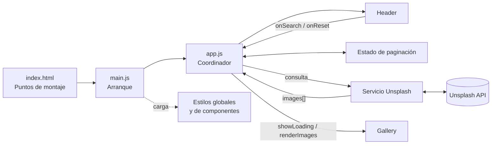
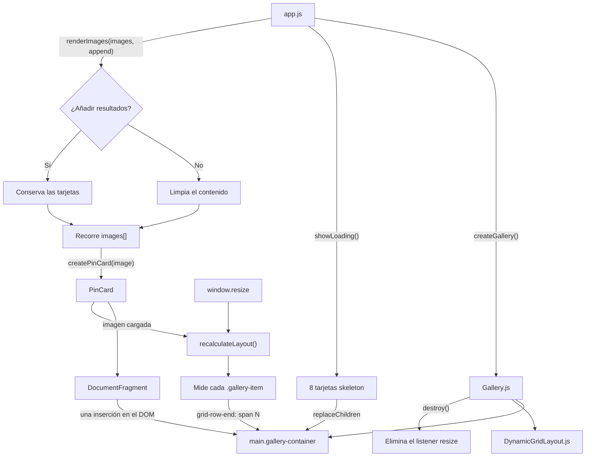
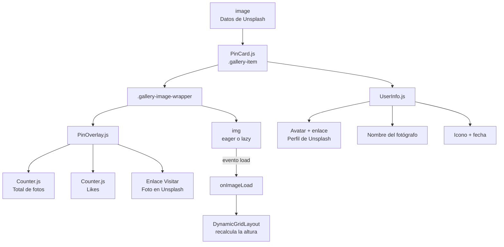

# Notas de desarrollo

## Descripción

Clon de una galería de Pinterest desarrollado con Vite, JavaScript, HTML y CSS.
Obtiene fotografías de Unsplash, permite buscar por texto y carga nuevas páginas
mediante desplazamiento infinito. Las tarjetas se distribuyen en una cuadrícula
responsive de altura variable.

El proyecto utiliza módulos ES y componentes construidos con la API del DOM, sin
framework de interfaz ni dependencias de producción.

## Puesta en marcha

1. Copiar `.env.example` como `.env` y asignar una clave válida a
   `VITE_UNSPLASH_ACCESS_KEY`.
2. Instalar las dependencias con `npm install`.
3. Iniciar el entorno local con `npm run dev`.

`npm run build` genera la versión de producción y `npm run preview` permite
revisarla localmente.

## Arquitectura

`main.js` carga los estilos e inicia la aplicación. A partir de ahí, `app.js`
coordina los componentes, el estado de paginación y las peticiones; los módulos
especializados no conocen el flujo completo de la aplicación.

### Funcionamiento de `Gallery`

La galería puede sustituir sus resultados —al iniciar, buscar o reiniciar— o
añadirlos durante la paginación. El uso de un `DocumentFragment` agrupa las
inserciones en el DOM. Después, el layout calcula la cantidad de filas que debe
ocupar cada tarjeta según su altura renderizada.

### Composición de `PinCard`

Cada resultado se divide en una imagen con acciones superpuestas y una zona con
la información del fotógrafo.

## Flujo de peticiones y paginación

- La carga inicial y el reinicio muestran las fotografías más recientes.
- Una búsqueda reinicia la página y sustituye los resultados anteriores.
- Un `IntersectionObserver` solicita la página siguiente antes de llegar al
  final de la galería y la añade sin borrar las tarjetas existentes.
- `AbortController` cancela una petición cuando una nueva búsqueda la reemplaza.
  Además, un identificador de versión impide renderizar respuestas obsoletas.
- La observación se detiene cuando Unsplash devuelve una página vacía.

## Integración con Unsplash

`unsplashApi.js` encapsula la configuración, la construcción de las URL y la
normalización de las dos respuestas utilizadas:

| Operación | Endpoint | Respuesta normalizada |
| --- | --- | --- |
| Fotografías recientes | `GET /photos?order_by=latest` | El array recibido |
| Búsqueda | `GET /search/photos?query=...` | El contenido de `results` |

Ambas peticiones incluyen la clave, la página actual y `per_page=16`. El resto
de la aplicación siempre recibe un array `images[]`, independientemente del
endpoint. De cada fotografía se consumen únicamente estos datos:

- imagen: `urls.small`, `width`, `height` y `alt_description`;
- fotografía: `links.html`, `created_at` y `likes`;
- autor: `name`, `total_photos`, `profile_image.medium` y `links.html`.

## Decisiones de interfaz y rendimiento

- Mientras se carga la primera página se muestran ocho tarjetas skeleton y
  `aria-busy` informa del estado a las tecnologías de asistencia.
- Las primeras cuatro imágenes usan carga prioritaria; el resto utiliza
  `loading="lazy"` y decodificación asíncrona.
- Los enlaces externos se abren con `noopener noreferrer`.
- Las acciones que aparecen al pasar el cursor también están disponibles al
  navegar con el teclado.
- Los estilos se importan desde `styles/index.css`, que centraliza el orden de
  los tokens, estilos base, utilidades y estilos de componentes.

## Limitaciones actuales

- Los errores de red, la ausencia de clave y las búsquedas sin resultados se
  registran en la consola, pero todavía no tienen un mensaje visual específico.
- La aplicación no incluye pruebas automatizadas.
- `Gallery` expone `destroy()` para retirar el listener de `resize`, aunque la
  instancia actual permanece montada durante toda la sesión y no necesita
  ejecutar esa limpieza.

## Uso de IA

Codex se utilizó como apoyo para revisar y refactorizar el proyecto. La lógica,
que inicialmente estaba concentrada en `main.js`, se separó en componentes,
servicios, estado y estilos con responsabilidades definidas. Los cambios se
revisaron de forma incremental para conservar el comportamiento existente.

Antes del refactor ya estaban implementados el diseño basado en Figma, la
cabecera responsive, la búsqueda y el reinicio, la conexión con Unsplash, las
tarjetas de altura variable y el cálculo de la cuadrícula.
