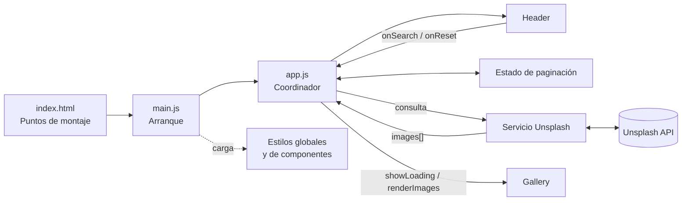
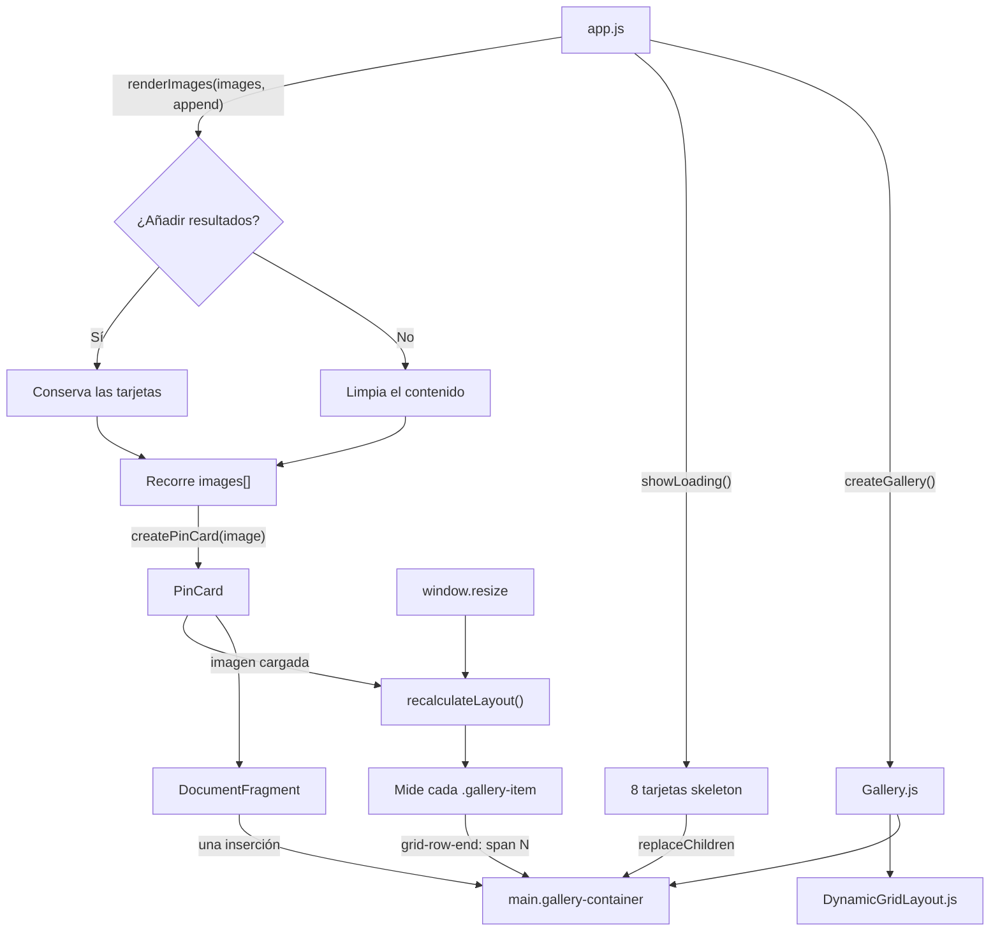
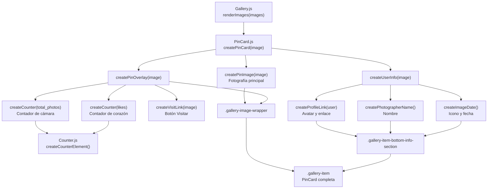

# Notas de desarrollo

Este documento explica la arquitectura y las decisiones técnicas del proyecto. La instalación y el stack están en el [README](../../README.md); la correspondencia con los criterios de evaluación está en la [justificación de requisitos](./justificacion-requisitos.md).

## Arquitectura

`main.js` carga los estilos e inicia la aplicación. `app.js` coordina los componentes, las peticiones y la paginación. Los módulos especializados reciben solo los datos o callbacks que necesitan.



## Funcionamiento de `Gallery`

La galería sustituye sus resultados al iniciar, buscar o reiniciar, y los añade durante la paginación. Un `DocumentFragment` agrupa las tarjetas antes de insertarlas en el DOM. Después, el layout mide cada tarjeta y calcula cuántas filas debe ocupar.



## Composición de `PinCard`

`createPinCard()` combina la fotografía y sus acciones superpuestas con la información del fotógrafo.



```text
.gallery-item                         ← createPinCard()
├── .gallery-image-wrapper
│   ├── imagen principal             ← createPinImage()
│   └── overlay                      ← createPinOverlay()
│       └── .gallery-item-top-overlay
│           ├── contador de cámara   ← createCounter(total_photos)
│           │                           └── createCounterElement()
│           ├── contador de corazón  ← createCounter(likes)
│           │                           └── createCounterElement()
│           └── botón Visitar        ← createVisitLink()
└── información del fotógrafo        ← createUserInfo()
    ├── avatar y enlace al perfil    ← createProfileLink()
    ├── nombre del fotógrafo         ← createPhotographerName()
    └── icono y fecha                ← createImageDate()
```

## Peticiones, búsqueda y scroll infinito

`unsplashApi.js` normaliza dos respuestas distintas para que el resto de la aplicación siempre reciba un array `images[]`:

| Operación | Endpoint | Resultado utilizado |
| --- | --- | --- |
| Fotografías recientes | `GET /photos?order_by=latest` | Array recibido |
| Búsqueda | `GET /search/photos?query=...` | Propiedad `results` |

Cada petición incluye la clave, la página actual y `per_page=16`. Una búsqueda o un reinicio sustituye los resultados y vuelve a la página 1.

Para el scroll infinito, `app.js` coloca después de la galería un elemento invisible llamado `infinite-scroll-trigger`. Un `IntersectionObserver` detecta cuándo se acerca a la pantalla y ejecuta `loadNextPage()`. La nueva página se añade sin borrar las tarjetas anteriores. El proceso no inicia peticiones duplicadas y se detiene cuando Unsplash deja de devolver resultados.

`AbortController` cancela una petición cuando una búsqueda nueva la reemplaza. Además, `requestVersion` impide renderizar una respuesta antigua si llega tarde.

## Datos utilizados de Unsplash

- Imagen: `urls.small`, `width`, `height` y `alt_description`.
- Fotografía: `links.html`, `created_at` y `likes`.
- Autor: `name`, `total_photos`, `profile_image.medium` y `links.html`.

`views` y `downloads` solo aparecen en peticiones de detalle. No se solicitan para evitar una llamada adicional por cada tarjeta y consumir rápidamente el límite de la API.

## Decisiones de interfaz y rendimiento

- Se muestran ocho skeletons mientras carga una primera página; `aria-busy` comunica el estado a las tecnologías de asistencia.
- Las primeras cuatro imágenes tienen prioridad. Las demás utilizan `loading="lazy"` y decodificación asíncrona.
- Los enlaces externos usan `noopener noreferrer`.
- Las acciones visibles al pasar el cursor también aparecen al navegar con teclado.
- `DynamicGridLayout.js` recalcula las alturas al cargar imágenes y al redimensionar la ventana.
- Los estilos entran por `styles/index.css`, que mantiene el orden entre tokens, base, utilidades y componentes.

## Limitaciones actuales

- Los errores de red, la falta de clave y las búsquedas sin resultados se registran en consola, pero no tienen un mensaje visual específico.
- El proyecto no incluye pruebas automatizadas.
- `Gallery` expone `destroy()` para retirar el listener de `resize`, aunque la instancia actual permanece montada toda la sesión.

## Uso de IA

La primera versión del proyecto se desarrolló manualmente. Antes de utilizar Codex ya estaban implementados el layout basado en Figma, la mayor parte del HTML y CSS, la cabecera responsive, las tarjetas de altura variable, las peticiones a Unsplash, la búsqueda y el reinicio mediante el logo.

Codex empezó a utilizarse cuando la aplicación ya funcionaba, como apoyo para revisar y refactorizar el código. La lógica que estaba más concentrada se repartió en componentes, servicio de API, estado y estilos con responsabilidades más claras, procurando conservar el diseño y el comportamiento existentes.

También se utilizó Codex como apoyo para implementar el scroll infinito, incluyendo la paginación, el `IntersectionObserver`, la prevención de peticiones duplicadas y la cancelación de respuestas obsoletas. Cada cambio se revisó de forma incremental antes de integrarlo en el proyecto.

Esto está reflejado en la historia de los commit y puedo mostrar el chat con Codex si es necesario. 
