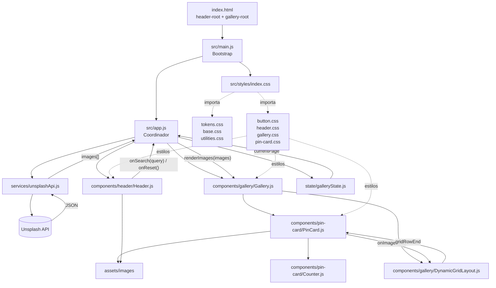

# Notas para el revisor

## Resumen

Este proyecto es una galeria de imagenes estilo Pinterest creada con Vite, JavaScript, HTML y CSS. La aplicacion consulta la API de Unsplash, monta sus componentes desde JavaScript y distribuye las tarjetas en una cuadricula de altura variable.

`main.js` es el punto de entrada y solo carga los estilos e inicia la aplicacion. `app.js` funciona como coordinador: conecta la cabecera, la galeria, el servicio de Unsplash y el estado de paginacion sin mezclar sus responsabilidades internas.

## Flujo de la aplicacion

1. `index.html` proporciona los puntos de montaje `header-root` y `gallery-root`.
2. `main.js` carga `styles/index.css` y ejecuta `startApp()`.
3. `app.js` crea `Header` y `Gallery`, y solicita las imagenes mediante `unsplashApi.js`.
4. `Header.js` comunica las busquedas y el reinicio mediante los callbacks `onSearch` y `onReset`.
5. `Gallery.js` recibe la lista de imagenes y crea un `PinCard` por cada resultado.
6. `PinCard.js` compone la imagen, los datos del autor, el enlace y los componentes `Counter`.
7. `DynamicGridLayout.js` mide las tarjetas y calcula su `grid-row-end` cuando cargan las imagenes o cambia el ancho de la ventana.

## Diagrama de arquitectura

## Responsabilidades principales

- `app.js`: coordina el flujo de datos y las acciones de la interfaz.
- `unsplashApi.js`: contiene configuracion, peticiones, errores y normalizacion de respuestas de Unsplash.
- `galleryState.js`: conserva el numero de pagina actual.
- `Header.js`: crea la navegacion y emite acciones de busqueda o reinicio.
- `Gallery.js`: crea el contenedor, limpia resultados anteriores y renderiza tarjetas.
- `PinCard.js`: construye cada tarjeta y sus datos visuales.
- `DynamicGridLayout.js`: calcula la ocupacion vertical y limpia su listener global mediante `destroy()`.
- `styles/index.css`: define el orden unico de carga de estilos globales y de componentes.

## Pendientes conocidos

Los comentarios `TODO` del codigo conservan decisiones todavia abiertas, principalmente la llamada inicial de Unsplash, los contadores temporales, los estados de carga/error/vacio y algunas revisiones de CSS y accesibilidad.

## Uso de IA

Utilicé Codex como apoyo para refactorizar y reorganizar el proyecto en módulos más claros y fáciles de mantener. Durante ese proceso no cambié la lógica funcional, salvo ajustes puntuales necesarios para conservar el comportamiento existente.

La asistencia de IA se usó de forma guiada: revisé cada cambio paso a paso antes de consolidarlo, en lugar de aplicar una actualización masiva sin validación. Antes del refactor, el proyecto ya incluía un clon de Pinterest alineado con el diseño de Figma: cabecera responsive con navegación, buscador, iconos y perfil; galería dinámica conectada a Unsplash con búsqueda y reinicio desde el logo; tarjetas de altura variable con imagen, autor, fecha, enlace, perfil y contadores superpuestos; y cálculo automático de filas para reducir huecos en la cuadrícula. La principal mejora del refactor fue separar responsabilidades, ya que gran parte de la lógica estaba concentrada en main.js y los estilos se encontraban repartidos en varios archivos CSS.